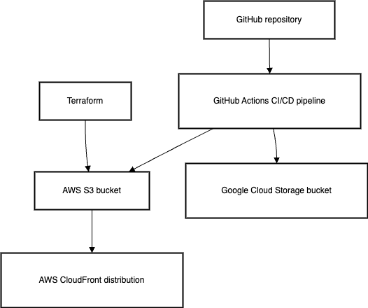
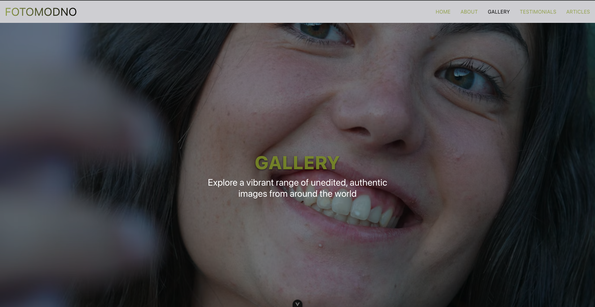

# Fotomodno Website

## Project Overview

Fotomodno is a modern static website built to showcase the raw beauty of unedited photography. The site is designed as a professional magazine to inspire authenticity and natural aesthetics. It demonstrates advanced cloud engineering skills, including:

- **Infrastructure as Code (IaC):** Provisioning AWS resources (S3, CloudFront, and logging) using Terraform.
- **CI/CD Pipeline:** Automated deployments via GitHub Actions.
- **Multi-Cloud Deployment:** A proof-of-concept deployment on both AWS and Google Cloud Storage.
- **Modern Front-End:** Developed with Vue.js, Vite, and Tailwind CSS for a responsive, visually stunning design.

This project serves as both a product for the client and as a resume-enhancing demonstration of cutting-edge cloud engineering and web development practices.

## Architecture Diagram

## Terraform & CI/CD

### Terraform (Infrastructure as Code)

- **AWS Resources**: This project uses Terraform to provision:
  - An **S3 Bucket** for static website hosting.
  - A **CloudFront Distribution** to serve content globally with low latency.
  - A **Bucket for CloudFront logs** (optional).
- **Configuration**: The Terraform files (`terraform/` folder) define the resources, IAM roles/policies, and outputs (e.g., the CloudFront domain).
- **Benefits**: Consistency across environments, version-controlled infrastructure, and repeatable deployments.

### GitHub Actions (CI/CD)

- **Workflow**: Whenever a push to the `main` branch occurs, GitHub Actions:
  1. Checks out the repository.
  2. Installs dependencies & builds the Vue.js project.
  3. Deploys the `dist/` folder to the AWS S3 bucket (and optionally triggers a CloudFront invalidation).
- **Multi-Cloud Note**: A second job or step can sync the `dist/` folder to **Google Cloud Storage** for a quick multi-cloud demonstration.
- **Logs & Monitoring**: The GitHub Actions logs show each step’s status. CloudFront logs can be stored in an S3 logging bucket for analytics.

## Multi-Cloud Deployment

To showcase cloud-agnostic flexibility, Fotomodno is also deployed on **Google Cloud Storage (GCS)**:

- **GCS Bucket**: `fotomodno-demo2` hosts the same `dist/` build.
- **Deployment**: Manually using `gsutil` or an additional step in GitHub Actions.
- **Note on Vue Router**: Since GCS static hosting doesn’t fully support path rewriting, direct sub-route refreshes may show a 404 unless using hash mode or a rewrite hack. For a quick demo, you can access `https://storage.googleapis.com/fotomodno-demo2/index.html`.

This proves the site can be hosted on multiple clouds with minimal changes, enhancing resiliency and portability.

## Screenshots

**Home Page**

**About Page**

**Gallery Page**

**Testimonials Page**

**Articles Page**

## Case Study & Lessons Learned

### Motivation

I built Fotomodno to explore how unedited photography can celebrate natural beauty in a magazine-like format. Beyond the aesthetic goal, this project also served as a chance to demonstrate advanced cloud skills—provisioning infrastructure with Terraform, automating deployments via GitHub Actions, and hosting in multiple clouds.

### Key Challenges

- **Vue Router & History Mode:** Direct refreshes on sub-routes (e.g., `/about`) can 404 unless you configure a rewrite or switch to hash mode.
- **CloudFront Invalidation:** Ensuring updated files are served immediately required automating `aws cloudfront create-invalidation`.
- **GCS Limitations:** Google Cloud Storage static hosting doesn’t support path rewriting by default, which led to partial solutions or acceptance of 404 on refresh.
- **Security & Access Control:** Managing S3 bucket policies, CloudFront logging, and GCS public access required careful IAM setup.

### Solutions

- **Terraform for Infrastructure:** Wrote `.tf` files to define S3, CloudFront, logging buckets, and IAM roles. This guaranteed consistent, repeatable environments.
- **GitHub Actions CI/CD:** Automated build-and-deploy on each push to `main`, including a step to invalidate CloudFront for fresh content. (Optional step to sync with GCS.)
- **Rewrite Approaches:** Used `-m index.html -e index.html` on AWS S3 to support SPA routes. For GCS, either accepted partial 404 or recommended hash mode.
- **Multi-Cloud Approach:** Demonstrated the same static files can live on AWS and GCS, proving portability and resiliency across providers.

Overall, Fotomodno provided a valuable learning experience in bridging modern front-end development with advanced cloud engineering practices, culminating in a polished, multi-cloud-ready project.
